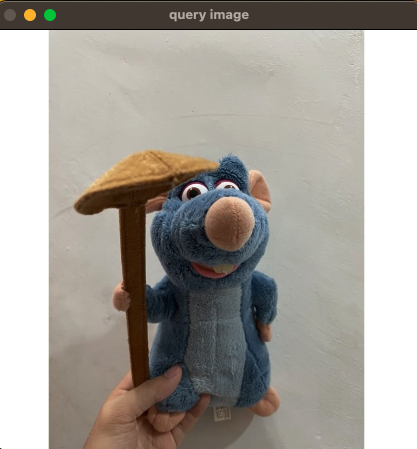
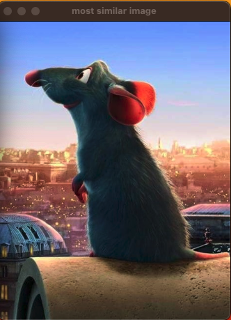

[](https://www.linkedin.com/in/mingjun-m-0bb5401a1/)


# Image Retrieval System

## Table of Contents

- [Background](#background)
- [Install](#install)
- [Usage](#usage)
- [Result](#result)
- [Contact](#contact)
- [License](#license)

## Background

This project based on paper *[Aggregating local descriptors into a compact image representation](https://ieeexplore.ieee.org/document/5540039)*. The image retrieval program implemented by VLAD (vector of locally aggregated descriptors) algorithm using **C++** and **OpenCV**. It can help you train your own image retrieval system using your image dataset.

## Install

This project uses [C++](https://cplusplus.com/) and [OpenCV](https://opencv.org/) library. Go check them out if you don't have them locally installed.

```sh
# check c++ installation
$ g++ --version

# install OpenCV using brew
$ brew install opencv
```

## Usage

Using **CMakeLists.txt** to build project.

- Step 1: Build your VLAD vector and visual vocabulary

```sh
    ./build ${path_to_images_dataset} ${path_to_save_visual_vocabulary} ${path_to_save_vlad_vector_model}
```

- Step 2: Image retrieved using query image from user

```sh
    ./app ${path_to_query_image} ${path_to_visual_vocabulary} ${path_to_vlad_vector_model}
```

Showcase: https://www.youtube.com/watch?v=6zu_ttuSKGU

## Result

<div style="display:flex; justify-content: center;">
    <div style="flex: 10%; padding: 10px;">
        
        <p style="text-align: center;">Query image from user</p>
    </div>
    <div style="flex: 10%; padding: 10px;">
        
        <p style="text-align: center;">Result</p>
    </div>
</div>

## Contact

[Author](https://mingjm3.github.io/)
[Linkedin](https://www.linkedin.com/in/mingjun-m-0bb5401a1/)

## License

[Apache License 2.0](https://github.com/mingjm3/image_retrieval_system/blob/master/LICENSE)

---

## 🎉 Stargazers

[](https://github.com/mingjm3/image_retrieval_system/stargazers)
